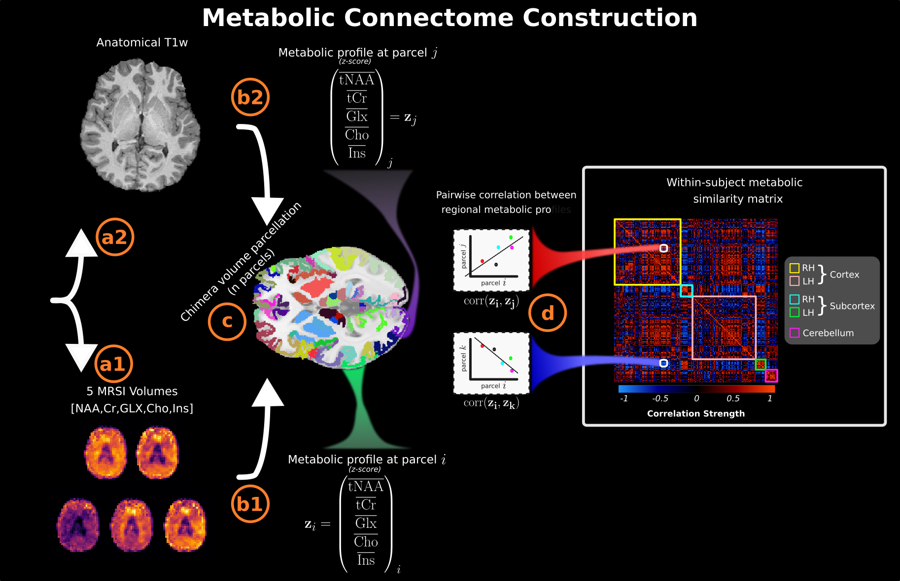

# 🧠 Constructing the Metabolic Connectome from MRSI

This repository provides tools to construct a within-subject **Metabolic Similarity Matrix (MeSiM)** based on MRSI scans, as detailed in our [preprint](https://www.biorxiv.org/content/10.1101/2025.03.10.642332v1).



---

## 📜 License

Licensed under the terms specified in [LICENSE](./LICENSE).

---

## 📂 Dataset

A demo dataset is available at `data/BIDS/Dummy-Project` and constructed MeSiMs from the Geneva-Study in `data/BIDS/Geneva-Study/derivatives/connectivity`.

To access the full dataset, contact the authors with a detailed research proposal explaining your intended use.

---

## ⚙️ Installation

### Requirements

- **Python 3.x**
- **Conda / Miniconda** (optional, but recommended)
- **[CHIMERA](https://github.com/connectomicslab/chimera)** for anatomical parcellation

### Setup Instructions

1. **Clone the Repository**
   ```bash
   git clone git@github.com:MRSI-Psychosis-UP/MRSI-Metabolic-Connectome.git
   cd MRSI-Metabolic-Connectome
   ```

2. **Install the Environment**
   ```bash
   bash build_env.sh
   ```

3. **Activate the Environment**
   ```bash
   conda activate mrsitooldemo_env
   ```

4. **Set Environment Paths**
   ```bash
   python set_env_paths.py
   ```
   Use the provided demo BIDS dataset (`data/BIDS`) if applicable.

---

## 🗂️ Inputs

### Chimera Anatomical Parcellation Files

- Example for subject `S0001-V1`:
   ```bash
   chimera -b data/BIDS/Dummy-Project/ \
           -d data/BIDS/Dummy-Project/derivatives/ \
           --freesurferdir data/BIDS/Dummy-Project/derivatives/freesurfer/ \
           -p LFMFIIFIS -g 2
   ```
- Parcellations saved in `PROJECT_NAME/derivatives/chimera-atlases`.

---

### MRSI Files

- MRSI files should be placed in:
   ```
   PROJECT_NAME/derivatives/mrsi-<space>/sub-<subject_id>/ses-<session>/
   ```

- File naming convention:
   ```
   sub-<subject_id>_ses-<session>_space-<space>_met-<metabolite>_desc-<description>_mrsi.nii.gz
   ```

| **BIDS Prefix**  | **Description**                        | **Choices**                                                                                           |
|------------------|----------------------------------------|-------------------------------------------------------------------------------------------------------|
| `subject_id`     | Subject/Participant ID                 |                                                                                                       |
| `session`        | Session ID                             | `[V1, V2, V3, ...]`                                                                                   |
| `space`          | MRI Acquisition space                  | `orig`, `origfilt`, `t1w`, `mni`                                                                      |
| `metabolite`     | MRSI Metabolite                        | `Ins`, `CrPCr`, `GPCPCh`, `GluGln`, `NAANAAG`, `water`                                                |
| `description`    | MRSI Map Description                   | `signal`, `crlb`, `fwhm`, `snr`, `filtharmonic`, `brainmask`                                          |

---

## 🧩 Steps to Construct a within-subject MeSiM

1. **Create MRSI-to-T1w Transforms**
   ```bash
   python experiments/MeSiM_pipeline/registration_mrsi_to_t1.py --group Dummy-Project --ref_met CrPCr --subject_id S001 --session V1 --nthreads 16
   ```

2. **Map Chimera Parcel Image to MRSI Space**
   ```bash
   python experiments/MeSiM_pipeline/map_parcel_image_to_mrsi.py --group Dummy-Project --subject_id S001 --session V1 --parc LFMIHIFIS --scale 3
   ```

3. **Construct MeSiM**
   ```bash
   python experiments/MeSiM_pipeline/construct_MeSiM_subject.py --group Dummy-Project --subject_id S001 --session V1 --parc LFMIHIFIS --scale 3 --npert 50 --show_plot 1 --nthreads 16 --analyze 1
   ```

- **Outputs**: Transforms, coregistered parcellations, and MeSiMs are saved in the `derivatives/` folder.

---

### Input Options Description

| **Arg Name**      | **Description**                                                                 | **Type**      | **Default**    |
|-------------------|---------------------------------------------------------------------------------|---------------|----------------|
| `--group`         | BIDS project folder name                                                        | string        | Dummy-Project  |
| `--subject_id`    | Subject ID, e.g., S001                                                          | string        | S001           |
| `--session`       | Session ID, e.g., V1                                                            | string        | V1             |
| `--parc`          | Chimera parcellation string                                                     | string        | LFMIHIFIS      |
| `--npert`         | Number of metabolic profile perturbations                                       | integer       | 50             |
| `--leave_one_out` | Leave-one-metabolite-out option (0 or 1)                                        | int [0,1]     | 0              |
| `--show_plot`     | Show plots (0 or 1)                                                             | int [0,1]     | 0              |
| `--overwrite`     | Overwrite existing results (0 or 1)                                             | int [0,1]     | 0              |
| `--ref_met`       | Reference metabolite for coregistration                                         | string        | CrPCr          |
| `--nthreads`      | Number of parallel CPU threads                                                  | integer       | 4              |
| `--t1`            | Path to T1-weighted image                                                       | string        | None           |
| `--t1mask`        | Path to T1-weighted brain mask                                                  | string        | None           |

---

## 🔄 Batch Processing

1. **Create MRSI-to-T1w Transforms**
   ```bash
   python experiments/MeSiM_pipeline/registration_mrsi_to_t1_batch.py --group Dummy-Project --ref_met CrPCr --nthreads 16 --participants $PATH2_PARTICIPANT-SESSION_FILE --t1pattern acq-memprage_desc-brain_T1w
   ```

2. **Construct MeSiM**
   ```bash
   python experiments/MeSiM_pipeline/construct_MeSiM_subject_batch.py --group Dummy-Project --parc LFMIHIFIS --scale 3 --npert 50 --show_plot 0 --nthreads 16 --analyze 1 --participants $PATH2_PARTICIPANT-SESSION_FILE --t1pattern acq-memprage_desc-brain_T1w
   ```

3. **Construct MeSiM Population Average**
   ```bash
   python experiments/MeSiM_pipeline/construct_MeSiM_pop.py --group Geneva-Study --parc LFMIHIFIS --scale 3 --npert 50 --participants $PATH2_PARTICIPANT-SESSION_FILE
   ```

- **Note**: `--participants` refers to a BIDS-style `participants_allsessions.tsv`. Defaults to `$BIDSDATAPATH/group` if not specified.

---

<<<<<<< HEAD
## 📊 MeSiM Analysis
=======
-  **Create T1w-to-MNI transforms (1 subject-session)**  
   ```python
   python experiments/MeSiM_pipeline/registration_t1_to_MNI.py --group Dummy-Project  --subject_id S001 --session V1 --nthreads 16 --t1 $PATH2TW_FILE

-  **Create T1w-to-MNI transforms (batch process)**  
   ```python
   python experiments/MeSiM_pipeline/registration_t1_to_MNI_batch.py --group Dummy-Project  --particpants $PATH2_PARTICIPANT-SESSION_FILE --nthreads 16 --t1pattern T1PATTERM
>>>>>>> 312e52ea74444ad3ff663d90f46b655308806d67

1. **Construct Metabolic Similarity Map (Single Subject)**
   ```bash
   python experiments/MeSiM_analysis/construct_MSI-map_subj.py --group Geneva-Study --parc LFMIHIFIS --scale 3 --npert 50 --dimalg pca_tsne
   ```

<<<<<<< HEAD
2. **Construct Metabolic Similarity Map (Population)**
   ```bash
   python experiments/MeSiM_analysis/construct_MSI-map_pop.py --group Geneva-Study --parc LFMIHIFIS --scale 3 --npert 50 --dimalg pca_tsne --msiscale -255.0
   ```

3. **Inverse Map MSI to MRSI Signal (Population)**
   ```bash
   python experiments/MeSiM_analysis/construct_MSI-map_pop.py --group Geneva-Study --parc LFMIHIFIS --scale 3 --npert 50 --dimalg pca_tsne
   ```

4. **Construct Metabolic Fibre (Population)**
   ```bash
   python experiments/MeSiM_analysis/construct_metabolic_fibre.py --group Geneva-Study --parc LFMIHIFIS --scale 3 
   --h both
   ```
- **Note**: `--dimalg` refers to the manifold discovery algorithm useful to construct the subsequent metabolic fibre. `--h` specifies which hemisphere to restrain the fibre construction [`lh` or `rh`]. Metabolic Fibre is constructed as an edge bundled network and rendered on your default browser at `127.0.0.0:PORT`  
---
=======
- **Coregister all MRSI metabolites to T1 & MNI space (1 subject-session)** 
   ```python
    python experiments/MeSiM_pipeline/transform_mrsi_to-t1_to-mni.py --group Dummy-Project --subject_id S001 --session V1  --nthreads 16

- **Coregister all MRSI metabolites to T1 & MNI space (batch process)** 
   ```python
    python experiments/MeSiM_pipeline/transform_mrsi_to-t1_to-mni_batch.py --group Dummy-Project  --particpants $PATH2_PARTICIPANT-SESSION_FILE  --nthreads 16


- **Notes**
     For batch processing, specify a T1 pattern  ```--t1pattern``` that matches the corresponding T1 image path (e.g ```acq-memprage```,```brain_T1W```)
>>>>>>> 312e52ea74444ad3ff663d90f46b655308806d67

## 🛠️ Useful MRSI Processing Tools

- **T1w-to-MNI Transforms (1 subject)**
   ```bash
   python experiments/MeSiM_pipeline/registration_t1_to_MNI.py --group Dummy-Project --subject_id S001 --session V1 --nthreads 16
   ```
- **T1w-to-MNI Transforms (population)**
   ```bash
   python experiments/MeSiM_pipeline/registration_t1_to_MNI_batch.py --group Dummy-Project --nthreads 16 --participants $PATH2_PARTICIPANT-SESSION_FILE
   ```

- **Coregister All MRSI Metabolites to T1 & MNI (1 subject)**
   ```bash
   python experiments/MeSiM_pipeline/transform_mrsi_to-t1_to-mni.py --group Dummy-Project --subject_id S001 --session V1 --nthreads 16
   ```
- **Coregister All MRSI Metabolites to T1 & MNI (population)**
   ```bash
   python experiments/MeSiM_pipeline/transform_mrsi_to-t1_to-mni_batch.py --group Dummy-Project --nthreads 16
   --participants $PATH2_PARTICIPANT-SESSION_FILE
   ```
