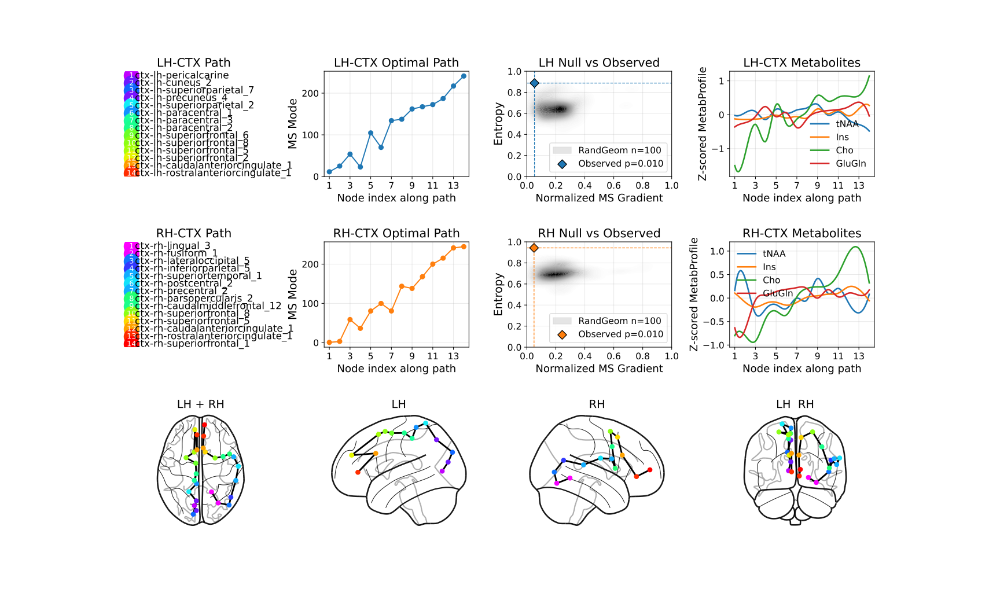
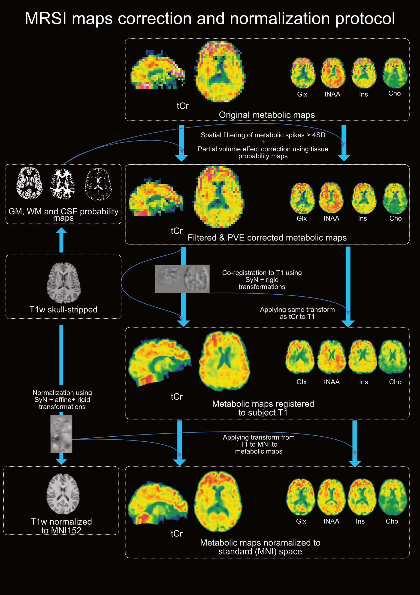

# 🧠 MRSI Toolbox Kit

This repository provides tools and preprocessing utilites to construct a within-subject **Metabolic Similarity Matrix (MeSiM)** based on MRSI scans, as detailed in [biorxiv](https://www.biorxiv.org/content/10.1101/2025.03.10.642332v1) and preparing files for a voxel-based analysis as detailed in [biorxiv](https://www.biorxiv.org/content/10.1101/2025.06.22.660965v1)

## 📚 Table of Contents

- [🧩 Construct a within-subject MeSiM](#-construct-a-within-subject-mesim)
- [📊 MeSiM Analysis](#-mesim-analysis)
- [🔧 Pre-Processing Pipeline for Voxel-Based Analysis](#-pre-processing-pipeline-for-voxel-based-analysis)

---

## 📜 License

The repository is distributed under the CHUV license [LICENSE](./LICENSE).

---

## 🧑‍💻 Contributors

| Name               | GitHub Profile                                   | Email                      |
|--------------------|--------------------------------------------------|----------------------------|
| Federico Lucchetti | [@fedlucchetti](https://github.com/fedlucchetti) | federico.lucchetti@unil.ch |
| Edgar Céléreau     | [@mrspsy](https://github.com/mrspsy)             | edgar.celereau@unil.ch     |

---
## 📂 Dataset

A demo dataset is available at `data/BIDS/Dummy-Project` and constructed MeSiMs from the Geneva-Study in `data/BIDS/Geneva-Study/derivatives/connectivity`.

To access the full dataset, contact the authors with a detailed research proposal explaining your intended use.

---

## ⚙️ Installation

### Requirements

- **Python 3.x**
- **Conda / Miniconda** (optional, but recommended)
- **[CHIMERA](https://github.com/connectomicslab/chimera)** for anatomical parcellation

### Setup Instructions

1. **Clone the Repository**
   ```bash
   git clone git@github.com:MRSI-Psychosis-UP/MRSI-Metabolic-Connectome.git
   cd MRSI-Metabolic-Connectome
   ```

2. **Install the Environment**
   ```bash
   bash build_env.sh
   ```

3. **Activate the Environment**
   ```bash
   conda activate mrsitooldemo_env
   ```

4. **Set Environment Paths**
   ```bash
   python set_env_paths.py
   ```
   Use the provided demo BIDS dataset (`data/BIDS`) if applicable.

---

## 🗂️ Inputs

### List of Participants/Subject File
- BIDS directory `PROJECT_NAME/` should contain a tab-separated `participants_allsessions.tsv` file following the BIDS standard `subject-id \t session-id`.

### MRSI Files

- MRSI files should be placed in:
   ```
   PROJECT_NAME/derivatives/mrsi-<space>/sub-<subject_id>/ses-<session>/
   ```

- File naming convention:
   ```
   sub-<subject_id>_ses-<session>_space-<space>_met-<metabolite>_desc-<description>_mrsi.nii.gz
   ```

| **BIDS Prefix**  | **Description**           | **Choices**                                                                                           |
|------------------|---------------------------|-------------------------------------------------------------------------------------------------------|
| `subject_id`     | Subject/Participant ID    |                                                                                                       |
| `session`        | Session ID                | `[V1, V2, V3, ...]`                                                                                   |
| `space`          | MRI Acquisition space     | `orig`, `t1w`, `mni`                                                                                  |
| `metabolite`     | MRSI resolved Metabolite  | **B<sub>0</sub> = 3T**: `Ins`, `CrPCr`, `GPCPCh`, `GluGln`, `NAANAAG`, `water`                                        |
|                  |                           | **B<sub>0</sub> = 7T**: `NAA`, `NAAG`, `Ins`, `GPCPCh`, `Glu`, `Gln`, `CrPCr`, `GABA`, `GSH`                          |
| `description`    | MRSI Map Description      | `signal`, `crlb`, `fwhm`, `snr`, `filtharmonic`, `brainmask`                                          |
### Anatomical Files

- **Chimera Anatomical Parcellation Files:**
   - Example for subjects T1w filenames stores in found in `t1s.txt` with chimera atlas LFMIHISIFF using the Lausanne cortical parcellation at scale 3 :
      ```bash
      chimera -b data/BIDS/Dummy-Project/ \
              -d data/BIDS/Dummy-Project/derivatives/ \
              --freesurferdir data/BIDS/Dummy-Project/derivatives/freesurfer/ \
              -p LFMIHISIFF -g 2 -s 3 -ids t1s.txt --nthreads 28
      ```
   - Parcellations saved in `PROJECT_NAME/derivatives/chimera-atlases`.

- **Partial Volume Correction (PVC) files:**

  Replace `<N>` with the appropriate tissue type index (e.g., `1` for GM, `2` for WM, `3` for CSF):

   ```bash
   PROJECT_NAME/derivatives/<PVCORR_DIR>/sub-<subject_id>/ses-<session>/sub-<subject_id>_ses-<session>_desc-p<N>_T1w.nii.gz
   ```

  - **Minimum required:**
    - `p1`: gray matter
    - `p2`: white matter
    - `p3`: CSF

  - **Additional tissue files may be included (optional).**

---

## 🧩 Construct a within-subject MeSiM

> **Batch mode semantics**
>
> * `--batch file` **requires** `--participants` to point to a `.tsv` file listing the subject–session pairs to process.
> * `--batch off` **requires** both `--subject_id` and `--session` and processes **one** acquisition (a single subject–session pair).
> * `--batch all` processes all discoverable subject–session pairs in the group.


1. **Create MRSI-to-T1w Transforms**
   ```bash
   python experiments/Preprocessing/registration_mrsi_to_t1.py --group Dummy-Project --ref_met CrPCr --subject_id S001 --session V1 --nthreads 16
   ```

2. **Map Chimera Parcel Image to MRSI Space**
   ```bash
   python experiments/MeSiM_pipeline/map_parcel_image_to_mrsi.py --group Dummy-Project --subject_id S001 --session V1 --parc LFMIHIFIS --scale 3
   ```

3. **Construct within-subject MeSiM**
   ```bash
   python experiments/MeSiM_pipeline/construct_MeSiM_subject.py --group Dummy-Project --subject_id S001 --session V1 --parc LFMIHIFIS --scale 3 --npert 50 --show_plot 1 --nthreads 16 --analyze 1
   ```

4. **Construct within-subject MeSiM (batch)**
   ```bash
   python experiments/MeSiM_pipeline/construct_MeSiM_subject.py --group Dummy-Project --parc LFMIHIFIS --scale 3 --npert 50 --show_plot 0 --nthreads 16 --analyze 1 --batch file --participants $PATH2_PARTICIPANT-SESSION_FILE --t1mask acq-memprage_desc-brain_T1w 
   ```

5. **Construct MeSiM Population Average**
   ```bash
   python experiments/MeSiM_pipeline/construct_MeSiM_pop.py --group Geneva-Study --parc LFMIHIFIS --scale 3 --npert 50 --participants $PATH2_PARTICIPANT-SESSION_FILE

- **Outputs**: Transforms, coregistered parcellations, and MeSiMs are saved in the `derivatives/` folder.

---

### Input Options Description

| **Arg Name**      | **Description**                                                                                                                                                 | **Type**                          | **Default**     |
| ----------------- | --------------------------------------------------------------------------------------------------------------------------------------------------------------- | --------------------------------- | --------------- |
| `--group`         | BIDS project folder name                                                                                                                                        | str                               | `Dummy-Project` |
| `--subject_id`    | Subject ID (e.g., `S001`). **Required when** `--batch off` (processes a single acquisition).                                                                    | str                               | `S001`          |
| `--session`       | Session label (e.g., `V1`). **Required when** `--batch off` (processes a single acquisition).                                                                   | str                               | `V1`            |
| `--parc`          | Chimera parcellation string                                                                                                                                     | str                               | `LFMIHIFIS`     |
| `--npert`         | Number of metabolic profile perturbations                                                                                                                       | int                               | `50`            |
| `--leave_one_out` | Leave-one-metabolite-out option                                                                                                                                 | int (0 or 1)                      | `0`             |
| `--show_plot`     | Show plots                                                                                                                                                      | int (0 or 1)                      | `0`             |
| `--overwrite`     | Overwrite existing results                                                                                                                                      | int (0 or 1)                      | `0`             |
| `--ref_met`       | Reference metabolite for coregistration                                                                                                                         | str                               | `CrPCr`         |
| `--nthreads`      | Number of parallel CPU threads                                                                                                                                  | int                               | `4`             |
| `--t1`            | Path or pattern to T1-weighted image                                                                                                                            | str                               | `None`          |
| `--t1mask`        | Path or pattern to T1-weighted brain mask                                                                                                                       | str                               | `None`          |
| `--b0`            | MRI B<sub>0</sub> field in Tesla                                                                                                                                | float (choices: 3, 7)             | `3`             |
| `--batch`         | Batch mode. `file` **requires** `--participants`; `off` **requires** `--subject_id` **and** `--session` (processes a single acquisition); `all` uses all pairs. | str (choices: `all`,`file`,`off`) | `off`           |
| `--participants`  | Path to a `.tsv` listing subject–session pairs to process (**required when** `--batch file`; ignored for `--batch off` and `--batch all`).                      | path                              | `None`          |

- **Note**: `--participants` refers to a BIDS-style `participants_allsessions.tsv`. Defaults to `$BIDSDATAPATH/group` if not specified.
---


---

## 📊 MeSiM Analysis

1. **Construct Metabolic Similarity Map (Single Subject)**
   ```bash
   python experiments/MeSiM_analysis/construct_MSI-map_subj.py --group Geneva-Study --parc LFMIHIFIS --scale 3 --npert 50 --dimalg pca_tsne
   ```

2. **Construct Metabolic Similarity Map (Population)**
   ```bash
   python experiments/MeSiM_analysis/construct_MSI-map_pop.py --group Geneva-Study --parc LFMIHIFIS --scale 3 --npert 50 --dimalg pca_tsne --msiscale -255.0
   ```

3. **Inverse Map MSI to MRSI Signal (Population)**
   ```bash
   python experiments/MeSiM_analysis/construct_MSI-map_pop.py --group Geneva-Study --parc LFMIHIFIS --scale 3 --npert 50 --dimalg pca_tsne
   ```

4. **Derive all GM constrained networtk paths**
   ```bash
   python experiments/MeSiM_analysis/find_all_network_paths.py --group Geneva-Study --parc LFMIHIFIS --scale 3
   --lobe LOBE --hemi HEMI --lpath 13
   ```
5. **Construct Metabolic Principal Curve (Population)**

   ```bash
   python experiments/MeSiM_analysis/construct_metabolic_principal_path.py --group Geneva-Study --parc LFMIHIFIS --scale 3 --diag group --lpath 13 --lobe ctx --nperm 100 --lobe ctx
   ```
- **Note**:  
  - Run first `find_all_network_paths.py` for both hemispheres `lh` and `rh` to construct all possible network paths then select the one which maximizes metabolic entropy and minimizes local metabolic heterogeneity with `construct_metabolic_principal_path.py` followed by comparison with a random geometric network and results figure generation.
  - `--dimalg` specifies the **manifold-discovery algorithm** used to construct the metabolic fibre.  
  - `--hemi`  chooses the **hemisphere** in which the fibre is built (`lh` or `rh`).  
  - `--lpath` sets the **maximum path length**.  
  - `--nperm` defines the **size of the null distribution**, generated from random-geometric networks.  
  - `--start` and `--stop` indicate the **start and stop nodes**.  
    - If not provided, they default to the **occipital region** (start) and **frontal/anterior cingulate regions** (stop), which maximise the inter-node MS-mode difference.  
    - The script then runs `find_all_network_paths.py` from scratch with these adjusted end-node labels.  
  - `--lobe` restricts the path search to either the **neocortex** (`ctx`) or the **subcortex** (`subc`).
---




## 🔧 Pre-Processing Pipeline for Voxel-Based Analysis

`experiments/Preprocessing/preprocess.py` now runs the full voxel-wise chain end-to-end: preflight checks, optional orientation correction, spike filtering, partial volume correction, and all registrations (MRSI→T1w, T1w→MNI, optional MNI152-long). Missing transforms are generated automatically; overwrite flags force regeneration.

**What it does**
- Checks required inputs (T1w, MRSI signals/CRLB/SNR/FWHM, CAT12 p1–p3 where available) and batches subject–session pairs from `participants_allsessions.tsv` or a custom TSV/CSV.
- Prints a preflight availability table per subject/session: existing files are marked with a green check, missing ones with a red X, and items marked **PROC** (orange) are auto-generated during preprocessing (e.g., transforms or masks).
- Optionally reorients oblique FOVs (`--corr_orient 1`).
- Filters MRSI spikes (`--filtoption`, `--spikepc`) and builds brain masks if present.
- Runs/refreshes MRSI→T1w registration and T1w→MNI registration as needed; supports intermediate T1w outputs, MNI (PVC and non-PVC), and MNI152-longitudinal.
- Applies partial volume correction when p1/p2/p3 maps exist; otherwise PVC is skipped with a warning.

> **Batch mode semantics**
>
> * `--batch file` **requires** `--participants` to point to a `.tsv`/`.csv` listing the subject–session pairs to process.
> * `--batch off` **requires** both `--subject_id` and `--session` and processes **one** acquisition.
> * `--batch all` processes all discoverable subject–session pairs in the group.

**Quick start**

- Single subject (filtering → PVC → registrations)
  ```bash
  python experiments/Preprocessing/preprocess.py \
    --group Dummy-Project --subject_id S001 --session V1 \
    --t1 acq-memprage_desc-brain_T1w --b0 3 --nthreads 16 \
    --mrsi_t1wspace 1 --mni_no_pvc 0
  ```
- Batch (participants TSV/CSV)
  ```bash
  python experiments/Preprocessing/preprocess.py \
    --group Dummy-Project --b0 3 --nthreads 16 \
    --batch file --participants $PATH2_PARTICIPANT-SESSION_FILE \
    --t1 acq-memprage_desc-brain_T1w \
    --mrsi_t1wspace 1 --proc_mnilong 0
  ```
- Optional add-ons: `--corr_orient 1` to fix oblique FOV; `--mni_no_pvc 1` to also export non-PVC MNI maps.

**Key `preprocess.py` options**

| Argument | Default | Purpose |
| -------- | ------- | ------- |
| `--t1` | `None` | Required T1w path or pattern (resolved per subject/session). |
| `--group` | `Mindfulness-Project` | BIDS project under `$BIDSDATAPATH`. |
| `--b0` | `3` (`3`/`7`) | Sets metabolite list (3T vs 7T). |
| `--filtoption` | `filtbiharmonic` | Spike filtering strategy. |
| `--spikepc` | `99` | Percentile for spike removal. |
| `--nthreads` | `4` | CPU threads for filtering, PVC, and transforms. |
| `--batch` | `off` (`all`/`file`/`off`) | Process all pairs, a TSV/CSV list (`--participants`), or a single pair. |
| `--overwrite_filt`, `--overwrite_pve` | `0` | Recompute filtering or PVC outputs. |
| `--overwrite_t1_reg`, `--overwrite_mni_reg` | `0` | Force regeneration of MRSI→T1w or T1w→MNI transforms. |
| `--overwrite_mni`, `--overwrite_mnilong` | `0` | Rerun MNI outputs at orig resolution or MNI152-longitudinal. |
| `--tr_mrsi_t1`, `--mrsi_t1wspace` | `0` | Write intermediate T1w-space outputs (raw/PVC respectively). |
| `--mni_no_pvc` | `0` | Also export non-PVC maps in MNI space. |
| `--proc_mnilong` | `0` | Generate MNI152-longitudinal outputs (requires template transforms). |
| `--corr_orient` | `0` | Correct oblique FOV orientation for MRSI and masks. |

Input notes: `--participants` can be TSV/CSV (columns like `participant_id`, `session_id`); default is `$BIDSDATAPATH/<group>/participants_allsessions.tsv` (V2BIS rows are skipped). PVC needs CAT12 p1/p2/p3 maps; if absent, PVC is skipped and logged.

**Population quality mask**

```bash
python experiments/Preprocessing/compute_pop_qmask.py \
  --group Dummy-Project --participants $PATH2_PARTICIPANT-SESSION_FILE \
  --snr 4 --crlb 20 --fwhm 0.1 --alpha 0.68 --b0 3
```

**Registration helpers (optional)**  
All registration is triggered automatically by `preprocess.py`. Run these directly only for debugging or bespoke registration:

- MRSI→T1w (batch capable)
  ```bash
  python experiments/Preprocessing/registration_mrsi_to_t1.py \
    --group Dummy-Project --ref_met CrPCr --nthreads 16 \
    --batch file --participants $PATH2_PARTICIPANT-SESSION_FILE \
    --t1 acq-memprage_desc-brain_T1w
  ```
- T1w→MNI (batch capable)
  ```bash
  python experiments/Preprocessing/registration_t1_to_MNI.py \
    --group Dummy-Project --nthreads 16 \
    --batch file --participants $PATH2_PARTICIPANT-SESSION_FILE
  ```





